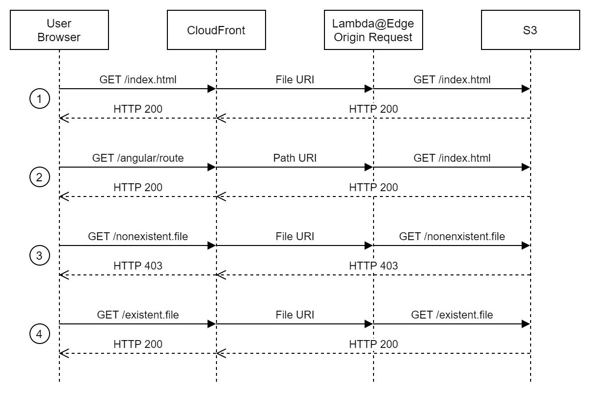
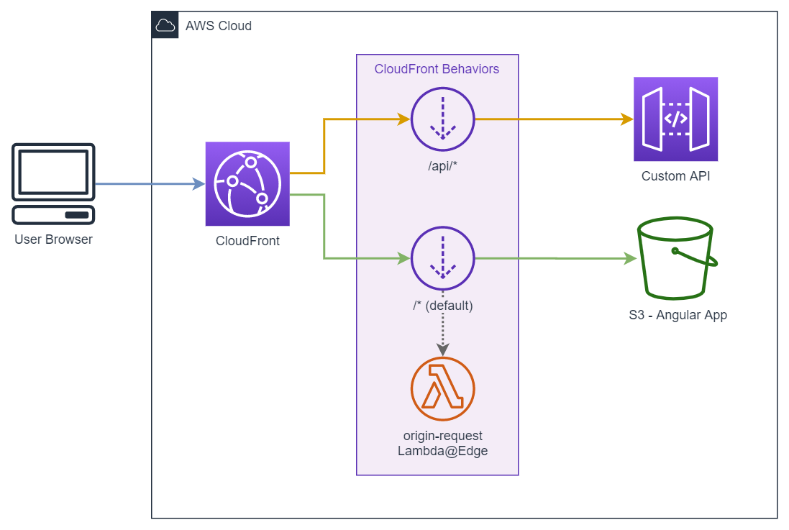

# SPA client side routing

A Lambda@Edge Function, executed upon CloudFront's _Origin Request_ behavior, to re-write route requests for Angular Applications.

## Why?

S3 origins lack the ability to route Angular requests correctly to `/index.html`. 

The usual approach to solve this problem is to configure distribution's _Custom Error responses_ in order to intercept all the 403 and 404 errors from the origin and return `index.html` file instead.

However, this approach has a mayor disadvantage. When the CloudFront distribution is shared with other origins, for instance an API, the _Custom Error responses_ configuration affects all of the origins. That could lead to some misfortunes behaviors.

This Lambda@Edge Function rewrites Angular URI paths against `/index.html`.



The main benefit of this solution is that it only affects to desired origins.



## Lambda Function code

The code of the Lambda Function is vastly based on the work of [Paul Taylor](https://github.com/ptylr/Lambda-at-Edge/tree/master/EdgeAngular) with minor modifications.


```javascript
'use strict';
const level = 0; // subdirectory level where index.html is located.
exports.handler = (event, _context, callback) => {
    const request = event.Records[0].cf.request;
    const isFile = uri => /^\/.+(\.\w+$)/.test(uri);
    if (!isFile(request.uri)) {
        let defaultPath = '';
        let i;
        const parts = request.uri.split('/');
        const nparts = parts.length - 1;
        const limit = (level <= nparts) ? level : nparts; 
        for (i = 1; i <= limit; i++) {
            defaultPath += '/' + parts[i];
        }
        const olduri = request.uri;
        request.uri = ('/' + defaultPath + '/index.html').replace(/(\/)\/+/g, '$1');
        console.log('Request for [' + olduri + '], rewritten to [' + request.uri + ']');
    }
    callback(null, request);
};
```

## Deployment

1. Deploy the CloudFormation template [cf-spa-routing.yml](cf-spa-routing.yml) as a new stack on `us-east-1` region.
2. In the CloudFront distribution configure _Origin Request_ event for the desired behavior (usually Default) to include the ARN of the Lambda Version provided in the CloudFormation stack Outputs.

>Alternatively, it is possible to integrate this CloudFormation template in a larger stack in order to reference the lambda version ARN in the CloudFront distribution behavior.

```yaml
Resources:
  CloudFrontDist:
    Type: AWS::CloudFront::Distribution
    Properties: 
      DistributionConfig: 
        DefaultCacheBehavior:
          LambdaFunctionAssociations:
            - 
              EventType: origin-request
              LambdaFunctionARN: !Ref LambdaVersion
```
## Customization
This Lambda function redirects to `/index.html` when a route is requested by default. However, there are situations where is necessary to locate `index.html` object inside a subdirectory. An example of this is having two or more Angular deployments under the same CloudFormation, for example `/app1/index.html` and `/app2/index.html`

To allow this, it is possible to indicate the directory level where the `index.html` is located by setting `level` constant at the beginning of the code.

Some examples to illustrate this.

Config|Requested URI|Result URI
---|---|---
`const level = 0;`|`/foo/bar`|`/index.html`
`const level = 1;`|`/foo/bar`|`/foo/index.html`
`const level = 2;`|`/foo/bar`|`/foo/bar/index.html`
## Credits
Thanks to [Paul Taylor](https://github.com/ptylr) for the function's code.
## License
[MIT License](LICENSE)